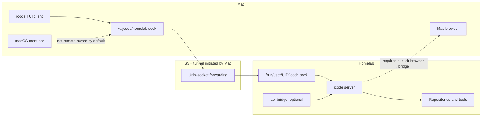
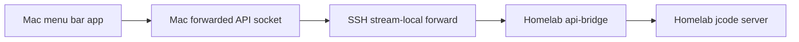
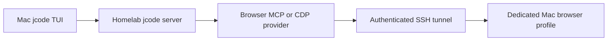

# Mac-to-Homelab Jcode SSH Topology

> Command Center update: remote browser access for the command center must use an explicit authenticated tunnel or bridge. The homelab daemon remains the authority for repositories, tools, provider credentials, and live runtime evidence; no unauthenticated command-center listener should be exposed to LAN, tailnet, or internet. See [`COMMAND_CENTER.md`](./COMMAND_CENTER.md).

This guide builds the recommended setup one feature at a time. The Mac initiates every SSH connection, so the homelab never needs to SSH back into the Mac.

## Topology



Replace:

- `homelab` with the existing SSH host alias from the Mac's `~/.ssh/config`.
- `/home/nyaptor/dev/project` with the repository path on the homelab.
- `<UID>` with the homelab user's numeric UID from `id -u`.

## Feature 1: Run the jcode server on the homelab

### Goal

Keep the agent runtime, sessions, repositories, shells, MCP servers, credentials, builds, and tool execution on the homelab.

### Commands

From the Mac, enter the homelab:

```bash
ssh homelab
```

On the homelab, start and inspect the daemon:

```bash
jcode server start
jcode server status
ls -l "/run/user/$(id -u)/jcode.sock"
```

The underlying server process can also be started directly:

```bash
jcode serve --server-name homelab
```

### Placement

- **Server:** homelab
- **Sessions:** homelab
- **Repositories:** homelab
- **Shell, file, browser, and MCP tools:** homelab by default
- **Server socket:** `/run/user/<UID>/jcode.sock` on the homelab

### Result

The homelab becomes the authoritative runtime. Closing a Mac client does not terminate the server or its other sessions.

## Feature 2: Forward the server socket to the Mac

### Goal

Make the homelab Unix socket appear as a local Unix socket on the Mac without exposing a TCP service.

### Commands on the Mac

Find the homelab UID:

```bash
ssh homelab 'id -u'
```

If it prints `1000`, the remote socket is `/run/user/1000/jcode.sock`.

Remove a stale local socket and start the tunnel:

```bash
rm -f ~/.jcode/homelab.sock

ssh -NT \
  -o ExitOnForwardFailure=yes \
  -o ServerAliveInterval=30 \
  -o ServerAliveCountMax=3 \
  -L ~/.jcode/homelab.sock:/run/user/1000/jcode.sock \
  homelab
```

Leave this SSH process running.

### Placement

- **Real socket:** homelab
- **Forwarded socket:** `~/.jcode/homelab.sock` on the Mac
- **Tunnel:** initiated and maintained by the Mac

### Result

Mac programs connect to `~/.jcode/homelab.sock`. SSH securely transports the stream to the homelab's jcode socket. No jcode TCP port is exposed to the LAN, tailnet, or internet.

## Feature 3: Run the TUI client on the Mac

### Goal

Render the TUI and accept keyboard input on the Mac while all agent work executes on the homelab.

### Command on the Mac

```bash
jcode \
  --socket ~/.jcode/homelab.sock \
  -C ~ \
  --remote-working-dir /home/nyaptor/dev/project
```

If the project also has a Mac checkout:

```bash
jcode \
  --socket ~/.jcode/homelab.sock \
  -C ~/dev/project \
  --remote-working-dir /home/nyaptor/dev/project
```

`-C` must exist on the Mac. `--remote-working-dir` must be an absolute existing directory on the homelab.

### Placement

- **TUI rendering and keyboard input:** Mac
- **jcode server:** homelab
- **Session working directory:** homelab
- **Bash, file operations, Git, builds, and tests:** homelab
- **Provider and MCP execution:** homelab

### Result

The Mac acts as a frontend for the homelab runtime. Agent tool calls operate on the homelab repository.

## Feature 4: Make the SSH tunnel reusable

### Goal

Store the forwarding and connection-health settings in the Mac's SSH configuration.

### Mac SSH configuration

Add this to `~/.ssh/config`:

```sshconfig
Host jcode-homelab
    HostName <homelab-host-or-tailscale-name>
    User nyaptor
    ExitOnForwardFailure yes
    ServerAliveInterval 30
    ServerAliveCountMax 3
    StreamLocalBindUnlink yes
    LocalForward ~/.jcode/homelab.sock /run/user/1000/jcode.sock
```

Start the tunnel:

```bash
ssh -NT jcode-homelab
```

Connect the TUI:

```bash
jcode \
  --socket ~/.jcode/homelab.sock \
  --remote-working-dir /home/nyaptor/dev/project
```

### Result

The SSH alias owns the transport configuration. `StreamLocalBindUnlink yes` allows SSH to replace a stale local Unix socket.

## Feature 5: Run the tunnel in the background

### Goal

Keep the forwarded socket available without occupying a terminal.

### Commands on the Mac

```bash
ssh -fNT jcode-homelab
ls -l ~/.jcode/homelab.sock
```

Inspect the background tunnel before stopping it:

```bash
pgrep -af 'ssh.*jcode-homelab'
```

Terminate only the identified tunnel process:

```bash
kill <PID>
```

For permanent operation, use a dedicated macOS LaunchAgent rather than an untracked background process.

### Result

Mac TUI clients can open and close while the secure path to the homelab remains available.

## Feature 6: Add a remote jcode wrapper

### Goal

Create one Mac command that always opens a client against the homelab.

### Commands on the Mac

```bash
mkdir -p ~/.local/bin

cat > ~/.local/bin/jcode-homelab <<'EOF'
#!/bin/sh
exec jcode \
  --socket "$HOME/.jcode/homelab.sock" \
  -C "$HOME" \
  --remote-working-dir /home/nyaptor/dev/project
EOF

chmod +x ~/.local/bin/jcode-homelab
```

Run it:

```bash
~/.local/bin/jcode-homelab
```

### Result

Launchers, hotkeys, and terminal aliases can target one stable command instead of duplicating connection arguments.

## Feature 7: Configure the launcher

### Goal

Make jcode available from the Mac application launcher.

### Command on the Mac

```bash
jcode setup-launcher
```

### Limitation

The default launcher starts local jcode. It does not automatically select `~/.jcode/homelab.sock` or a homelab working directory. A remote-specific launcher should invoke:

```bash
~/.local/bin/jcode-homelab
```

### Result

A custom launcher can open a Mac TUI attached to the homelab server.

## Feature 8: Configure the global hotkey

### Goal

Open jcode through a global keyboard shortcut on the Mac.

### Command on the Mac

```bash
jcode setup-hotkey
```

### Limitation

The default hotkey starts local jcode. Remote operation requires configuring the hotkey integration to invoke:

```bash
~/.local/bin/jcode-homelab
```

The SSH tunnel must already be running, or the wrapper must be extended to establish it safely.

### Result

A global shortcut can open a Mac client attached to the homelab runtime.

## Feature 9: Understand the built-in menubar

### Goal

Show running and streaming session counts in the macOS menu bar.

### Commands on the Mac

```bash
jcode menubar
jcode menubar --once
jcode menubar --json
```

### Current limitation

The built-in menubar reads Mac-local runtime state such as `~/.jcode/active_pids`. It does not currently query the forwarded homelab server through `--socket`, even though inherited global options can appear in its help output.

Therefore, this is not an authoritative remote monitor:

```bash
jcode menubar --socket ~/.jcode/homelab.sock
```

### Result

The built-in menubar monitors local Mac jcode state. A remote-aware menubar requires a server-backed data source.

## Feature 10: Build a remote-aware menubar with `api-bridge`

### Goal

Let a Mac menu bar application obtain authoritative session information from the homelab.

### Topology



Inspect the available bridge options on the homelab:

```bash
jcode api-bridge --help
```

The API supports server-backed capabilities including session listing. A custom menu bar application can query those results instead of reading Mac-local PID files.

### Result

A remote-aware menu bar could show homelab session names, counts, state, and server identity. `api-bridge` supplies the API but does not render a menu bar itself.

## Feature 11: Run browser automation on the homelab

### Goal

Let remote jcode sessions use a browser located on the same machine as the server.

### Commands on the homelab

```bash
jcode browser setup
jcode browser status
```

### Placement

- **Browser provider and browser process:** homelab
- **Tool request origin:** Mac TUI through the homelab jcode server

### Result

This supports web research, screenshots, page inspection, and headless browser testing without exposing browser control across machines.

## Feature 12: Control a visible browser on the Mac

### Goal

Keep the jcode server on the homelab while operating a dedicated Chrome or Firefox profile on the Mac.

The primary jcode socket tunnel does not provide this. It requires a second explicit browser transport:



### Safest simple choice

Run a separate local jcode server for browser-heavy work:

```bash
jcode
jcode browser setup
```

### Advanced choice

Run a browser MCP or Chrome DevTools provider on the Mac and expose it only through SSH. Use:

- A dedicated browser profile
- A localhost-only listener
- An authenticated SSH tunnel
- Explicit browser permissions
- No publicly reachable Chrome DevTools port

### Result

The agent can interact with a visible Mac browser while retaining homelab execution. This should be added only after the main server tunnel is stable.

## Command location summary

| Command | Run on | Purpose |
|---|---|---|
| `jcode server start` | Homelab | Start the authoritative jcode daemon |
| `jcode serve --server-name homelab` | Homelab | Run the underlying named server process directly |
| `ssh -NT ... -L local.sock:remote.sock` | Mac | Forward the homelab Unix socket to the Mac |
| `jcode --socket ... --remote-working-dir ...` | Mac | Run the Mac TUI against the homelab runtime |
| `jcode setup-launcher` | Mac | Install local launcher integration |
| `jcode setup-hotkey` | Mac | Install local global-hotkey integration |
| `jcode menubar` | Mac | Show Mac-local jcode counts |
| `jcode api-bridge` | Homelab | Expose a stable API for a custom remote-aware client |
| `jcode browser setup` | Homelab | Configure browser automation beside the remote server |
| `jcode browser setup` | Mac | Configure automation for a Mac-local browser workflow |

## Recommended rollout

1. Start the jcode server on the homelab.
2. Establish the Unix-socket SSH tunnel from the Mac.
3. Connect the Mac TUI with `--socket` and `--remote-working-dir`.
4. Add the `jcode-homelab` wrapper.
5. Make the SSH tunnel persistent with a macOS LaunchAgent.
6. Point launcher and hotkey integrations at the wrapper.
7. Keep the built-in menubar local initially.
8. Build an `api-bridge` client only if authoritative remote status is needed.
9. Use homelab browser automation by default.
10. Add a Mac browser MCP or CDP bridge only when visible Mac browser control is required.

## Security boundaries

- Do not expose the jcode Unix socket as a public TCP listener.
- Initiate forwarding from the Mac through the existing authenticated SSH path.
- Keep forwarded sockets inside user-owned directories.
- Keep Chrome DevTools and browser MCP listeners bound to localhost.
- Never expose an unauthenticated browser-control endpoint to the LAN, tailnet, or internet.
- Use dedicated browser profiles for agent-controlled browsing.
