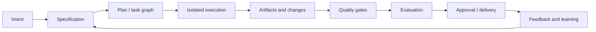

# AI Software Factory

> Status: proposed documentation index
> Authority: repository sources, OpenSpec design, and external research
> Claim labels: **observed**, **proposed**, **external research**, **open question**

## What this is

An AI software factory is a governed, artifact-centered delivery system that turns intent into verified, reproducible, observable change. It is larger than an agent, a prompt, a swarm, or a coding UI.

Jcode is an agent runtime evolving toward a local-first factory control plane. Its current strengths include sessions, provider/tool policy, memory, skills, ambient scheduling, task DAGs, swarm coordination, command-center projections, and evidence-oriented verification. The full provider-neutral lifecycle across workspaces, artifacts, gates, approvals, and delivery remains a **proposed** direction.

## Lifecycle

1. [Lifecycle](lifecycle.md)
2. [Architecture](architecture.md)
3. [Artifacts and provenance](artifacts-and-provenance.md)
4. [Workers and orchestration](workers-and-orchestration.md)
5. [Isolation and execution](isolation-and-execution.md)
6. [Gates and approvals](gates-and-approvals.md)
7. [Evaluation and regression](evaluation-and-regression.md)
8. [Observability](observability.md)
9. [Governance and risk](governance-and-risk.md)
10. [Feedback and learning](feedback-and-learning.md)
11. [Software-factory frameworks](frameworks.md)
12. [Open-harness landscape](open-harness-landscape.md)
13. [Jcode mapping](jcode-mapping.md)
14. [OAuth account routing](oauth-account-routing.md)
15. [Sources and limitations](sources-and-limitations.md)

## Vocabulary

| Term | Meaning |
|---|---|
| Agent shell | Interactive runtime for a model, context, tools, and a turn loop |
| Worker | Bounded agent execution against a task contract and workspace |
| Workflow | Deterministic stages and gates around agentic work |
| Factory | Durable system governing intent, artifacts, execution, evaluation, approval, and learning |
| Artifact | Named, versioned output such as a spec, plan, patch, trace, result, or approval |
| Gate | Evidence-backed condition required before a transition |

## Current versus target

| Area | Current Jcode evidence | Factory target |
|---|---|---|
| Agent runtime | **Observed:** turn loops, tools, providers, recovery, compaction | Stable worker contract |
| Coordination | **Observed:** swarms, task DAGs, messaging, gates | Provider-neutral run orchestration |
| Durability | **Observed:** sessions, memory, ambient schedules, initiatives | Unified initiative/task/run/artifact model |
| Verification | **Observed:** verification skill and repository checks | First-class gate and evidence contracts |
| Environments | **Partial:** local repository execution | Worktree/container/remote worker isolation |
| Delivery | **Partial:** command-center and workflow surfaces | Merge, PR, deployment, and rollback lifecycle |

## Reading rule

Use the lifecycle page for the main journey. Use cross-cutting pages for the machinery that supports multiple stages. Treat **observed** claims as current evidence, **proposed** claims as design direction, **external research** as comparative support, and **open question** claims as unresolved.
