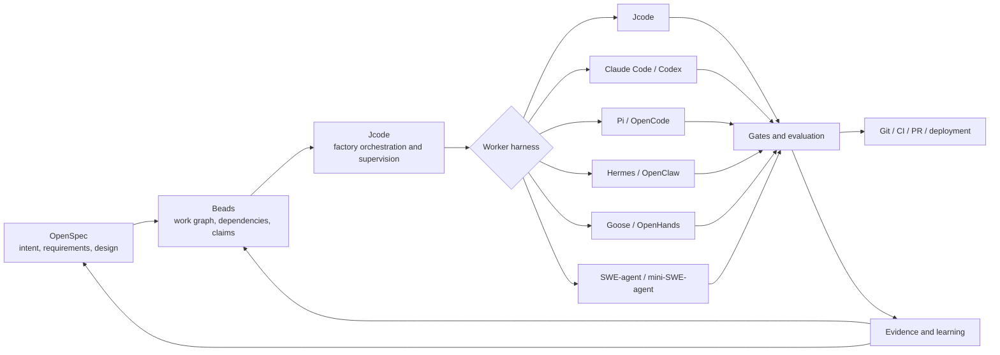

# Software-factory frameworks

> Status: research and proposed composition
> Claim labels: **observed**, **external research**, **proposed**, **open question**

## The key distinction

A software factory is not one framework. It is a composition of authorities, orchestration, execution, evaluation, and delivery surfaces.

| Layer | Responsibility | Strong candidates |
|---|---|---|
| Specification authority | What should be built and why | OpenSpec |
| Work authority | What is ready, blocked, owned, or dependent | Beads |
| Factory orchestrator | Which stage runs next and under what gate | Jcode, LangGraph, Microsoft Agent Framework |
| Agent runtime/harness | How a worker reasons and uses tools | Jcode, Claude Code, Codex, Pi, Hermes, OpenClaw, OpenCode, Goose, OpenHands, SWE-agent, mini-SWE-agent |
| Execution substrate | Where the work runs | Jcode local sessions, worktrees, containers, VMs, OpenHands backends |
| Evaluation and observability | Whether the work is correct and explainable | Jcode checks, LangSmith, Microsoft telemetry, OpenAI tracing, project CI |
| Delivery authority | Merge, PR, deploy, rollback | Git, CI/CD, deployment-specific systems |

No single candidate owns all layers cleanly. The strongest factory is compositional.

## Framework comparison

### OpenSpec

**Observed from the official project:** OpenSpec is a spec-driven development framework for AI coding assistants. Its workflow produces proposal, requirements/scenarios, design, and task artifacts before implementation, then supports apply and archive. It is deliberately repository-visible and tool-agnostic.

**Best role:** specification authority and change contract.

**Limitation:** OpenSpec does not by itself provide a durable worker fleet, sandbox scheduler, multi-agent runtime, or production observability plane.

Source: [Fission-AI/OpenSpec](https://github.com/Fission-AI/OpenSpec)

### Beads

**Observed from the official project:** Beads is a Git-friendly, dependency-aware issue and memory system for coding agents. It provides durable work state, dependencies, claims, formulas/workflows, and agent-oriented issue operations.

**Best role:** work authority and dependency graph below or beside a specification.

**Limitation:** Beads tracks work; it is not the complete specification authority, agent runtime, evaluator, or deployment system.

Source: [gastownhall/beads](https://github.com/gastownhall/beads)

### LangGraph

**External research:** LangGraph provides low-level primitives for stateful agent workflows, including single-agent, multi-agent, hierarchical, streaming, memory, and human-in-the-loop control. Its strength is explicit graph orchestration with flexible runtime behavior.

**Best role:** custom orchestration engine when the factory itself is being built as an application.

**Limitation:** it does not give a repository-native specification authority or issue graph by default. LangSmith adds related observability/evaluation/deployment capabilities but is a separate platform surface.

Source: [LangGraph](https://www.langchain.com/langgraph)

### Microsoft Agent Framework

**External research:** Microsoft Agent Framework combines agents, a batteries-included harness agent, functional and graph workflows, session state, context providers, middleware, MCP, telemetry, and integrations. It explicitly distinguishes open-ended agents from workflows with well-defined execution paths.

**Best role:** enterprise application framework for building a factory control service, especially in Python or .NET environments.

**Limitation:** it is not repository-native by default and introduces a larger application/runtime dependency than Jcode's local-first model.

Source: [Microsoft Agent Framework overview](https://learn.microsoft.com/en-us/agent-framework/overview/)

### OpenHands Agent Canvas

**External research:** OpenHands Agent Canvas acts as a self-hosted developer control center. It can run OpenHands or third-party ACP-compatible agents across local, remote, Docker, VM, and cloud backends, and supports automations through GitHub, Slack, Linear, and other integrations.

**Best role:** execution/control plane and agent-backend switchboard.

**Limitation:** it is more of a hosted control center than a specification-and-work-authority system. OpenSpec and Beads would still provide stronger repository-native intent and dependency semantics.

Source: [OpenHands](https://github.com/OpenHands/OpenHands)

## Recommended composition: the Open Factory Contract

The best fit for Jcode is a layered composition rather than adopting one external framework as the center.

### Authority boundaries

- **OpenSpec owns intent:** requirements, scenarios, design decisions, and implementation contract.
- **Beads owns work state:** task readiness, dependencies, claims, ownership, blockers, and resumable work items.
- **Jcode owns factory state:** initiatives, runs, workers, routing, gates, evidence, approvals, scheduling, and command-center projections.
- **Harnesses own local execution:** model interaction, context, tool use, edits, and local recovery.
- **CI and delivery systems own external truth:** build status, merge status, deployment health, and rollback evidence.

The same fact must not be silently owned by multiple systems. Jcode may project OpenSpec and Beads state, but should not fork their authority.

## Harness roster

The relevant harnesses used or evaluated in this research are:

- **Jcode:** local-first runtime, swarm, memory, scheduling, tools, durable initiatives, and verification.
- **Claude Code:** terminal/IDE agent with skills, hooks, subagents, and broad operational integrations.
- **Codex:** multi-agent worktrees, cloud environments, background work, skills, and review workflows.
- **Pi:** minimal self-extensible agent core, coding CLI, unified provider API, and external sandbox options.
- **Hermes Agent:** persistent operator-oriented runtime with skills, tools, and delegation.
- **OpenClaw:** always-on agent gateway with channels, extensions, and automation.
- **OpenCode:** open, provider-neutral coding harness and terminal workflow.
- **Goose:** extensible integration-oriented agent platform.
- **OpenHands:** sandbox/control-center platform with multiple agent backends.
- **SWE-agent / mini-SWE-agent:** bounded, evaluation-oriented repository workers.

They should be treated as interchangeable worker implementations only behind a common task and evidence contract. They are not interchangeable in safety, state, tool semantics, sandboxing, or trajectory format.

## Recommended factory run

1. OpenSpec proposal and scenarios are reviewed.
2. The proposal is decomposed into Beads work items with dependencies.
3. Jcode creates an initiative and run with source revision, risk policy, and acceptance gates.
4. Jcode routes each task to the least-powerful suitable harness.
5. The harness executes in an isolated workspace and returns a patch plus evidence.
6. Jcode runs deterministic gates and trajectory/outcome evaluation.
7. A human approves only risk-bearing transitions or unresolved ambiguity.
8. Delivery systems merge, deploy, or reject the result.
9. Jcode records the run, evidence, failure classification, and follow-up Beads/OpenSpec updates.

## Decision

**Proposed:** Jcode should act as the factory control plane, with OpenSpec and Beads as complementary repository authorities and the harnesses as replaceable worker runtimes. LangGraph or Microsoft Agent Framework are useful references or substrates for specialized factory services, but adopting either as Jcode's central authority would duplicate state and weaken the local-first repository model.

## Open questions

- Should Jcode expose a native adapter contract for Pi/OpenCode/Claude Code/Codex/ACP workers?
- Should Beads tasks reference OpenSpec requirement IDs directly, or should Jcode own the cross-reference projection?
- What minimum evidence bundle must every external harness return?
- Which execution adapters need true sandboxing versus worktree isolation?
- How should trajectory data be normalized without erasing harness-specific semantics?
