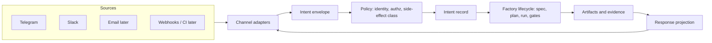
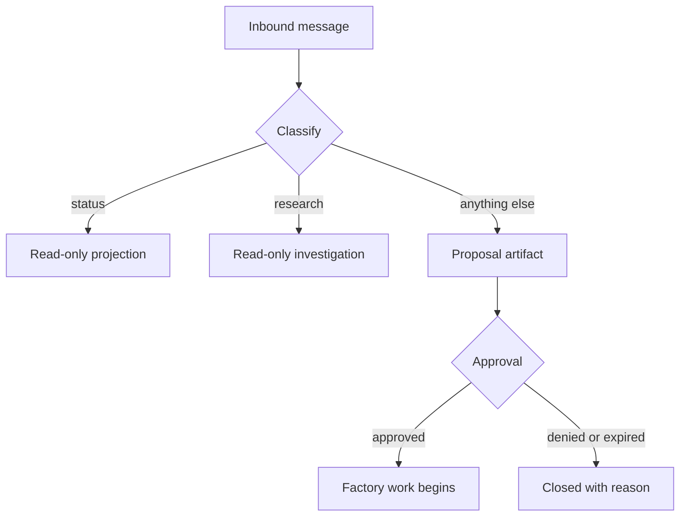

# Inbox Extensibility for the Software Factory Pattern

> Status: research
> Authority: repository evidence (`source/jcode/docs/factory/`, `ambient/queue.json`) and prior factory design work
> Purpose: constrain the Telegram and Slack inbox proposal so it becomes factory intake, not a chat feature

## Framing

The factory lifecycle is `intent -> specification -> plan -> execution -> artifacts -> gates -> evaluation -> delivery -> learning`.

A chat inbox is not a new subsystem. It is a **new intent source** and a **new approval surface** attached to the existing lifecycle. Every design decision below exists to keep it in that role.

## The seven decisions that determine extensibility

### 1. Separate transport, envelope, and intent

Three distinct layers, never merged:

- **Transport adapter:** provider protocol, signature verification, acknowledgement, retry semantics.
- **Envelope:** provider-neutral message record with a stable `dedupe_key`. The provider's own sequence number is not sufficient: Telegram specifies that `update_id` increases sequentially, but if no updates arrive for a week the next identifier is chosen **randomly** instead. A dedupe key derived from provider sequence alone would therefore break after any quiet period, which is the normal state of a single-operator inbox.
- **Intent:** the factory-level request, which may span several messages or none.

Merging envelope and intent is the most common failure. It forces every later source (email, webhook, CI callback, voice) to imitate chat message shape.

### 2. Make the channel a projection, not an owner

The chat thread must never hold authority. Durable state belongs to initiatives, specs, tasks, runs, and artifacts. The thread is a **rendered view plus an input device**.

Test: if the entire Telegram history were deleted, no factory state should be lost or ambiguous.

### 3. Model side-effect class at intake, not at execution

Classify each intent by reversibility before any worker starts:

| Class | Examples | Autonomy |
|---|---|---|
| read-only | status, explain, search, diff review | automatic |
| local-mutating | branch work, tests, docs, scratch runs | automatic with evidence |
| shared-mutating | push, merge, issue changes | approval |
| production | deploy, migration, secrets, external messaging | approval plus stronger gate |

This mirrors the existing governance rule that autonomy follows reversibility. Putting classification at intake means new channels inherit the policy for free.

### 4. Use one correlation identity across the whole lifecycle

A single correlation record must link: source event, envelope, intent, initiative or spec, task graph node, run, artifacts, gates, approvals, and the reply.

Without this, replies, retries, and audit break as soon as a second channel or a scheduled retry exists.

### 5. Make approvals a first-class artifact, not a chat reply

An approval packet needs proposed action, reason, affected surface, evidence, risk, reversibility, expiry, and allowed responses. The chat message renders the packet; it does not define it.

This is what allows the same approval to be answered from Telegram, Slack, the command center, or CLI.

### 6. Design the response path as evidence projection

Replies should be generated from artifacts and gate results, not from model narration. That guarantees factory truthfulness and makes the same output reusable in the command center, in PR comments, and in run summaries.

### 7. Treat the inbox as a control plane with its own budget

Rate limits, concurrency caps, queue depth, dead-letter handling, replay protection, and per-sender quotas must exist at intake. An unbounded intent source will otherwise saturate worker capacity.

## Extension seams to build in from day one

| Seam | Why it must exist early | Cost if deferred |
|---|---|---|
| Channel adapter interface | Adding email, webhook, CI, or voice later | Rewrites of triage and reply logic |
| Envelope schema version | Provider payload evolution | Silent parsing breakage |
| Identity mapping table | One human across Telegram, Slack, Git, and CI | Approval identity cannot be trusted |
| Intent classifier boundary | Swapping heuristics for models or rules | Policy embedded in adapters |
| Command grammar registry | New factory verbs over time | Ad-hoc command parsing per channel |
| Approval token store | Multi-channel and delayed approvals | Approvals only valid in one thread |
| Artifact reference resolver | Rendering runs, diffs, gates into any channel | Duplicate formatting code |
| Redaction policy hook | Secrets and customer data in chat | Irreversible disclosure |

## Anti-patterns to prohibit explicitly

- Storing task state in chat message history.
- Passing raw provider payloads deeper than the adapter. Storing them in the intake store for audit and backfill is correct; letting downstream logic read them is not.
- Letting a chat reply directly trigger a mutating action without an approval artifact.
- Implementing Telegram first in a way that hardcodes single-chat assumptions.
- Treating message text as a command language without a versioned grammar.
- Allowing unbounded fan-out of runs from one conversation.

## What this changes in the proposal

The proposal should be written as **factory intake and control-plane capability**, with Telegram as the first adapter, rather than as "Telegram integration."

Recommended capability decomposition:

1. Intent intake contract, envelope, identity, correlation, and the SQLite intake store.
2. Side-effect classification and authorization policy.
3. Channel adapter interface plus Telegram adapter.
4. Approval artifact lifecycle.
5. Evidence projection and reply rendering.
6. Intake control plane: quotas, dedupe, retries, dead-letter, observability.
7. Slack adapter as the conformance proof of adapter neutrality.

Adding Slack second is the cheapest available test that the abstraction is real. If Slack requires changes outside its adapter, the boundary is wrong.

## Resolved decisions

### Intent records live in a dedicated intake store

Intake is a distinct authority from specification and work state.

| Store | Owns | Why it must not own intake |
|---|---|---|
| Intake store | Envelopes, intents, identity, correlation, approval tokens, delivery receipts | — |
| OpenSpec | Specifications and change contracts | Unfiltered chat noise would pollute the specification authority |
| Beads | Issues, dependencies, work state | Not every message becomes work; most never should |

The intake store holds **provider-shaped** input. OpenSpec and Beads hold curated, approved, durable authority. Promotion from intake into either is an explicit, audited transition, never an implicit write.

**Provider-shaped** means the data still carries the structure, vocabulary, and quirks of the messaging platform that produced it, rather than the structure the factory reasons in.

A Telegram webhook does not deliver "a request." It delivers an `Update` object with an `update_id`, at most one populated variant among its 26 optional fields (Bot API 10.2) (`message`, `edited_message`, `callback_query`, `my_chat_member`, and so on), a nested `Message` with `chat`, `from`, `entities`, and possibly media descriptors. Slack delivers a different envelope: a Socket Mode wrapper around an event with `team`, `channel`, `ts`, `thread_ts`, and block structures. Neither resembles the other, and neither resembles a specification or a task.

Provider-shaped data has four properties that make it unfit for durable authority:

| Property | Consequence |
|---|---|
| Platform-specific schema | `chat.id` and `channel` mean different things and are not interchangeable |
| Vendor-controlled evolution | Telegram shipped 10.0, 10.1, and 10.2 within 67 days (2026-05-08 to 2026-07-14), adding `guest_message`, `subscription`, and whole new message classes |
| One-to-many mapping | One intent may span several messages; one message may contain no intent at all |
| Delivery semantics baked in | Retries, edits, deletions, and ordering are transport concerns, not intent concerns |

The intake store is where that shape is allowed to exist and be preserved for audit. The **envelope** normalizes it. The **intent** is what the factory actually reasons about. Letting provider shape leak past intake is what makes a system permanently Telegram-flavored.

### Inbound messages never create initiatives directly

Default: an inbound message produces a **proposal awaiting approval**.

Two exceptions, both non-mutating:

- **Deliberate research requests:** may execute read-only investigation and return findings without approval.
- **Status requests:** may read and project existing factory state without approval.

Both exceptions are safe because they cannot change repository, production, or work state. Everything else, including anything that would create an initiative, a bead, a branch, or an external message, waits for an approval artifact.

Note that this is deliberately stricter than the general autonomy ladder in decision 3, which allows local-mutating work to proceed automatically with evidence. Chat is the lowest-friction input the factory has, so a misread intent turns into action faster here than anywhere else. The intake policy therefore withholds the local-mutating tier until an approval exists, and decision 3 continues to govern once work is under way. If that proves too conservative in practice, the tier to relax first is local-mutating work inside an already-approved initiative, not the default for a fresh message.

## Retention and redaction

### Decision: maximal retention

Keep everything, indefinitely, at every record class. The factory's value comes from replay, audit, deduplication, and a learning corpus, and all four degrade with deletion. This is a local-first, single-operator system, so the usual argument for aggressive expiry (large breach blast radius across many subjects) does not apply with the same force.

| Consequence | Effect |
|---|---|
| Replay and audit | Complete, permanently |
| Deduplication | Correct forever, no post-purge re-execution |
| Learning corpus | Grows monotonically |
| Storage | Text is negligible; media is content-addressed and deduplicated, never dropped for size |
| Exposure | Whatever is written stays written, so the write path is the only control point |

Because nothing is ever deleted, the **only** remaining control is what gets written in the first place.

### What redaction is actually for

Redaction is not censorship of the operator. Nothing is being hidden from you, and no policy assumes your messages are untrustworthy.

The single concrete hazard is this: chat is a low-friction channel, so credentials get pasted into it. That happens constantly and usually by accident, for example forwarding an error message that embeds a token, pasting a connection string while debugging, or relaying a webhook URL that carries a secret in its path.

Under maximal retention, a credential pasted once is retained forever.

The existing fleet doctrine already forbids reproducing credential values in durable output. The relevant rule is that when a credential is found, it is reported by location and type, never by value, and anything leaving a session is scrubbed before it is written. An always-on inbox is exactly such a durable sink.

So the scope of redaction is narrow and specific:

- **In scope:** credential-shaped strings, meaning API keys, bearer tokens, private keys, connection strings with embedded passwords, and secret-bearing URLs.
- **Out of scope:** everything else you write. Requests, opinions, file paths, repository names, error text, plans, and profanity are all stored verbatim.

### Why it still matters when the sender is trusted

Trust in the sender is not the same as trust in the storage. Retained credentials create risk independent of who typed them:

1. **Sink multiplication.** An inbox record is read by workers, projected into replies, included in evidence bundles, and potentially rendered in the command center. One paste becomes many copies.
2. **Rotation defeat.** Rotating a leaked credential does not remove the retained copy, so the audit trail permanently contains a live-looking secret.
3. **Backup reach.** Anything durable is backed up and synced, expanding the footprint beyond the original store.
4. **Provider-side copies.** The message already exists on the provider's servers, so a local permanent copy is additive exposure. Note this argument is weaker than it first appears: Telegram states that undelivered updates are not kept longer than 24 hours, so the provider copy of an update is transient while the local copy is permanent. The asymmetry strengthens rather than weakens the case for scrubbing at ingress.

### Decided posture

| Policy | Setting |
|---|---|
| Retention | Maximal, permanent, all record classes |
| Redaction scope | Credential-shaped strings only |
| Redaction point | Ingress, before first durable write, so the stored payload is verbatim except for credential markers |
| Non-credential content | Never redacted |
| On detection | Replace with a typed marker such as `[redacted: bearer_token]` and state in the reply that a redaction occurred |
| Recovery | The marker names the type and position, so the original can be re-supplied deliberately if it was a false positive |
| Media and attachments | Content-addressed, stored once, referenced rather than inlined |

This keeps the operator experience unchanged, preserves full fidelity for everything that matters, and closes the one failure mode that maximal retention would otherwise make permanent.

## Resolved: authorization, storage, and escalation

### A. Group conversation authorization

| Option | Behavior | Trade-off |
|---|---|---|
| A1. Private chat only | Reject all group and channel traffic | Simplest and safest; no team usage, no shared visibility |
| A2. Explicit mention required | Group messages count only when the bot is addressed or a command prefix is used | Low noise, predictable; misses context in surrounding replies |
| A3. Allowlisted groups, full read | Approved groups ingest all messages | Rich context and better triage; large volume, many non-intents, more retained third-party content |
| A4. Mention plus reply-thread capture | Mention opens a thread; subsequent replies in that thread are ingested | Best context-to-noise ratio; needs thread-state tracking per provider |
| A5. Per-sender authority within groups | Group is allowlisted, but only specific senders can trigger mutating proposals | Enables team visibility with single-operator authority; requires the identity mapping table to be correct |

**Decision: A2 now, A4 plus A5 later.**

Phase one ingests a group message only when the bot is explicitly addressed or a command prefix is used. This keeps the first implementation narrow and makes the ingestion boundary trivial to reason about: if the bot was not addressed, no record is created.

A4 and A5 are deferred, and nothing about them needs deciding now. Neither is load-bearing for phase one:

- **Thread identity is not urgent.** Maximal retention means the provider payload is kept permanently, redacted only for credential-shaped strings, and thread identifiers are not credential-shaped. `message_thread_id` and `thread_ts` can therefore be backfilled from stored payloads whenever A4 is actually built. Carrying the field in the envelope from the start is cheap and worth doing, but it is a convenience, not a one-way door.
- **The identity mapping table is already required without A5.** Decision 5 makes approvals answerable from Telegram, Slack, the command center, or CLI, which means one human must resolve to one identity across channels regardless of group policy. A5 would consume that table, not motivate it.

The only genuine constraint A2 places on later phases is the one already stated as an anti-pattern: do not hardcode single-chat assumptions. Group and thread scoping must be data on the envelope rather than an assumption in the adapter.

### B. Intake store location

| Option | Behavior | Trade-off |
|---|---|---|
| B1. In-repository files | Intake records committed as files | Trivially inspectable and versioned; pollutes history with high-volume chat data and cannot be redacted retroactively |
| B2. Local state directory | Files under Jcode local state, alongside the ambient queue | Matches existing ambient precedent, no new infrastructure; not versioned, needs its own backup story |
| B3. Embedded database in local state | SQLite for envelopes, intents, correlation, approvals | Real queries, indexes, and transactions; dedupe and approval expiry become simple; one more storage format to maintain |
| B4. Separate service | Standalone intake service with an API | Multi-host and multi-agent ready; heaviest operationally, contradicts local-first for a single operator |

**Decision: B3, embedded SQLite in local state, with media content-addressed on disk.**

Consequences to carry into the proposal:

- The database file lives in Jcode local state, not in the repository, so intake volume never enters version history and a redaction is always physically possible.
- Media and attachments are stored by content hash on disk; the database holds the hash, the provider file reference, and the size. Identical forwarded media is stored once.
- Schema migrations become a real obligation. Under maximal retention the store is never rebuilt from scratch, so every migration must be forward-only and non-destructive.
- The store needs its own backup story, since local state is typically outside the repository backup path.

### C. Redaction false-positive escalation

| Option | Behavior | Trade-off |
|---|---|---|
| C1. Silent redaction | Replace and continue | Zero friction; you may not notice real content was destroyed |
| C2. Marker plus notification | Replace with a typed marker and tell the sender in the reply | Transparent and cheap; slight reply noise |
| C3. Quarantine and confirm | Hold the suspected value out of the durable store, ask whether to keep it | No silent loss; adds a round trip and a temporary holding area, which is itself a sensitive store |
| C4. Sender override token | A prefix such as `!raw` disables redaction for that message | Full operator control; one careless override permanently stores a real secret |
| C5. Typed markers plus a detection log | Marker in the record, full detection event recorded separately with pattern, offset, and confidence | Auditable, tunable over time, no sensitive value retained |

**Decision: C2, marker plus notification. C4 is rejected outright.**

When a credential-shaped string is detected at ingress it is replaced with a typed marker such as `[redacted: bearer_token]`, and the reply states that a redaction occurred. Recovery from a false positive is simply re-sending the value deliberately.

No sender override token exists at any point. An override is the only option that can permanently defeat the single control that maximal retention leaves in place, and one careless use is unrecoverable.

C5's separate detection log is not adopted now. If redaction patterns later prove too aggressive or too permissive, a detection log recording pattern, offset, and confidence, but never the matched value, is the correct instrument to add.

## Remaining open question

- Should the identity mapping table be operator-maintained, or derived from provider profile data and confirmed once per identity? This matters for phase one because multi-channel approval identity depends on it, independently of any group-authorization policy.

## Validation performed

The guidance was tested against the real OpenSpec CLI rather than only reviewed. Two throwaway changes were built under `openspec/changes/`, validated with `openspec validate --strict`, and deleted.

| Test | Result |
|---|---|
| A change shaped by this guidance (envelope, approval, redaction requirements) | Valid under `--strict` |
| Adding a Slack adapter spec afterwards | Valid, and the `factory-intake` spec needed no edit, which is the adapter-neutrality claim holding in the only form testable before implementation |
| Negative control: a deliberately bad change storing task state in chat history and reading `chat.id` throughout | **Also valid under `--strict`** |

The negative control is the important result. The validator checks structure, requirement wording, and scenario shape. It does not check design quality, and it cannot detect the anti-patterns listed above.

This has a direct consequence for the proposal: **passing `openspec validate` is not evidence that the intake boundary is correct.** The anti-patterns in this document must be enforced by review, because no tool in the repository will catch them. A proposal that hardcodes single-chat assumptions will validate cleanly and still be wrong.

## Limitations

No inbox implementation exists yet. This document is design constraint research only, derived from repository factory documentation and the existing ambient queue behavior.

The adapter-neutrality claim is validated only at the specification level. Whether a Slack adapter truly requires no changes outside itself can only be proven by building both adapters, and that evidence does not exist yet.
