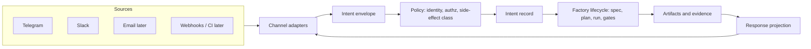
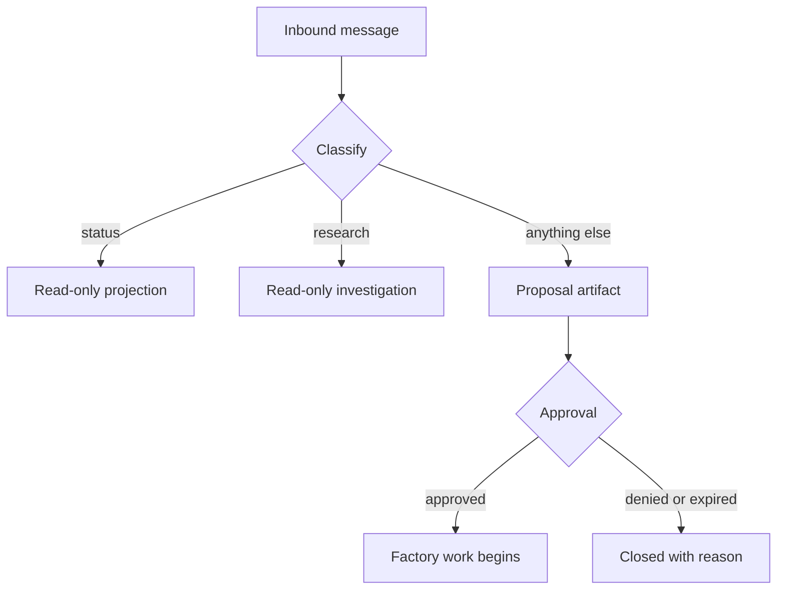

# Inbox Extensibility for the Software Factory Pattern

> Status: research
> Authority: repository evidence (`source/jcode/docs/factory/`, `ambient/queue.json`) and prior factory design work
> Purpose: constrain the Telegram and Slack inbox proposal so it becomes factory intake, not a chat feature

## Framing

The factory lifecycle is `intent -> specification -> plan -> execution -> artifacts -> gates -> evaluation -> delivery -> learning`.

A chat inbox is not a new subsystem. It is a **new intent source** and a **new approval surface** attached to the existing lifecycle. Every design decision below exists to keep it in that role.

## The seven decisions that determine extensibility

### 1. Separate transport, envelope, and intent

Three distinct layers, never merged:

- **Transport adapter:** provider protocol, signature verification, acknowledgement, retry semantics.
- **Envelope:** provider-neutral message record with a stable `dedupe_key`.
- **Intent:** the factory-level request, which may span several messages or none.

Merging envelope and intent is the most common failure. It forces every later source (email, webhook, CI callback, voice) to imitate chat message shape.

### 2. Make the channel a projection, not an owner

The chat thread must never hold authority. Durable state belongs to initiatives, specs, tasks, runs, and artifacts. The thread is a **rendered view plus an input device**.

Test: if the entire Telegram history were deleted, no factory state should be lost or ambiguous.

### 3. Model side-effect class at intake, not at execution

Classify each intent by reversibility before any worker starts:

| Class | Examples | Autonomy |
|---|---|---|
| read-only | status, explain, search, diff review | automatic |
| local-mutating | branch work, tests, docs, scratch runs | automatic with evidence |
| shared-mutating | push, merge, issue changes | approval |
| production | deploy, migration, secrets, external messaging | approval plus stronger gate |

This mirrors the existing governance rule that autonomy follows reversibility. Putting classification at intake means new channels inherit the policy for free.

### 4. Use one correlation identity across the whole lifecycle

A single correlation record must link: source event, envelope, intent, initiative or spec, task graph node, run, artifacts, gates, approvals, and the reply.

Without this, replies, retries, and audit break as soon as a second channel or a scheduled retry exists.

### 5. Make approvals a first-class artifact, not a chat reply

An approval packet needs proposed action, reason, affected surface, evidence, risk, reversibility, expiry, and allowed responses. The chat message renders the packet; it does not define it.

This is what allows the same approval to be answered from Telegram, Slack, the command center, or CLI.

### 6. Design the response path as evidence projection

Replies should be generated from artifacts and gate results, not from model narration. That guarantees factory truthfulness and makes the same output reusable in the command center, in PR comments, and in run summaries.

### 7. Treat the inbox as a control plane with its own budget

Rate limits, concurrency caps, queue depth, dead-letter handling, replay protection, and per-sender quotas must exist at intake. An unbounded intent source will otherwise saturate worker capacity.

## Extension seams to build in from day one

| Seam | Why it must exist early | Cost if deferred |
|---|---|---|
| Channel adapter interface | Adding email, webhook, CI, or voice later | Rewrites of triage and reply logic |
| Envelope schema version | Provider payload evolution | Silent parsing breakage |
| Identity mapping table | One human across Telegram, Slack, Git, and CI | Approval identity cannot be trusted |
| Intent classifier boundary | Swapping heuristics for models or rules | Policy embedded in adapters |
| Command grammar registry | New factory verbs over time | Ad-hoc command parsing per channel |
| Approval token store | Multi-channel and delayed approvals | Approvals only valid in one thread |
| Artifact reference resolver | Rendering runs, diffs, gates into any channel | Duplicate formatting code |
| Redaction policy hook | Secrets and customer data in chat | Irreversible disclosure |

## Anti-patterns to prohibit explicitly

- Storing task state in chat message history.
- Passing raw provider payloads deeper than the adapter.
- Letting a chat reply directly trigger a mutating action without an approval artifact.
- Implementing Telegram first in a way that hardcodes single-chat assumptions.
- Treating message text as a command language without a versioned grammar.
- Allowing unbounded fan-out of runs from one conversation.

## What this changes in the proposal

The proposal should be written as **factory intake and control-plane capability**, with Telegram as the first adapter, rather than as "Telegram integration."

Recommended capability decomposition:

1. Intent intake contract, envelope, identity, and correlation.
2. Side-effect classification and authorization policy.
3. Channel adapter interface plus Telegram adapter.
4. Approval artifact lifecycle.
5. Evidence projection and reply rendering.
6. Intake control plane: quotas, dedupe, retries, dead-letter, observability.
7. Slack adapter as the conformance proof of adapter neutrality.

Adding Slack second is the cheapest available test that the abstraction is real. If Slack requires changes outside its adapter, the boundary is wrong.

## Resolved decisions

### Intent records live in a dedicated intake store

Intake is a distinct authority from specification and work state.

| Store | Owns | Why it must not own intake |
|---|---|---|
| Intake store | Envelopes, intents, identity, correlation, approval tokens, delivery receipts | — |
| OpenSpec | Specifications and change contracts | Unfiltered chat noise would pollute the specification authority |
| Beads | Issues, dependencies, work state | Not every message becomes work; most never should |

The intake store holds high-volume, low-trust, provider-shaped input. OpenSpec and Beads hold curated, approved, durable authority. Promotion from intake into either is an explicit, audited transition, never an implicit write.

### Inbound messages never create initiatives directly

Default: an inbound message produces a **proposal awaiting approval**.

Two exceptions, both non-mutating:

- **Deliberate research requests:** may execute read-only investigation and return findings without approval.
- **Status requests:** may read and project existing factory state without approval.

Both exceptions are safe because they cannot change repository, production, or work state. Everything else, including anything that would create an initiative, a bead, a branch, or an external message, waits for an approval artifact.

## Retention and redaction trade-offs

Two independent axes. Retention is how long chat-derived data survives. Redaction is how much of it is ever stored.

### Retention options

| Option | Behavior | Gains | Costs |
|---|---|---:|---|
| Ephemeral | Keep envelope only until the intent resolves | Minimal exposure, smallest storage | No replay, weak audit, duplicate events can re-execute after purge |
| Short window | Retain raw payload 7–30 days, keep derived intent indefinitely | Debuggable, bounded exposure, dedupe still works | Incidents older than the window are unreproducible |
| Full retention | Keep everything indefinitely | Complete audit and replay, best learning corpus | Largest breach blast radius, compliance burden, storage growth |
| Tiered | Raw short, intent medium, approvals and receipts permanent | Matches value to risk per record class | More policy surface and migration logic |

### Redaction options

| Option | Behavior | Gains | Costs |
|---|---|---:|---|
| None | Store text verbatim | Perfect fidelity, easiest debugging | Secrets and personal data land in durable storage |
| Ingress redaction | Scrub secrets and identifiers before first write | Strongest protection, nothing sensitive ever persisted | Irreversible, false positives destroy real content, pattern gaps still leak |
| Egress redaction | Store raw, scrub on read and projection | Full fidelity retained, policy can improve later | Raw store remains a high-value target, every reader must enforce policy |
| Tokenized | Replace sensitive spans with references to a restricted vault | Reversible for authorized use, low exposure by default | Most complex, adds a second secured store and key management |

### The core tension

Retention and redaction pull in opposite directions:

- Auditability, replay, deduplication, and learning all want **more data for longer**.
- Breach blast radius, compliance obligations, and the risk of leaking secrets into chat all want **less data for less time**.

Note the asymmetry: **redaction failures are irreversible in both directions**. Redacting too aggressively destroys evidence permanently. Redacting too late means the secret was already written to disk, backups, and possibly logs.

### Recommendation

**Tiered retention with ingress redaction of high-confidence secrets, plus egress redaction for everything else.**

| Record class | Retention | Redaction |
|---|---|---|
| Raw provider payload | 14 days | Ingress scrub of credential-shaped tokens |
| Normalized envelope | 90 days | Ingress scrub, egress policy on read |
| Intent record | Life of related work plus 1 year | Egress |
| Approval artifact | Permanent | Egress, no raw payload embedded |
| Delivery receipt and gate evidence | Permanent | Egress |
| Attachments and media | 14 days, reference-only afterward | Never inlined into durable records |

Rationale: credential-shaped strings are the one class where the cost of a false positive is far lower than the cost of a miss, so they are removed before the first write. Everything else keeps fidelity long enough to debug and replay, while permanent records hold only decisions and evidence rather than raw conversation.

## Open questions

- How are group conversations authorized compared with private chats?
- Does the intake store live inside the repository, in local state, or in a separate service?
- What is the escalation path when ingress redaction fires on legitimate content?

## Limitations

No inbox implementation exists yet. This document is design constraint research only, derived from repository factory documentation and the existing ambient queue behavior.
