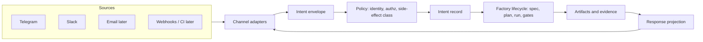

# Inbox Extensibility for the Software Factory Pattern

> Status: research
> Authority: repository evidence (`source/jcode/docs/factory/`, `ambient/queue.json`) and prior factory design work
> Purpose: constrain the Telegram and Slack inbox proposal so it becomes factory intake, not a chat feature

## Framing

The factory lifecycle is `intent -> specification -> plan -> execution -> artifacts -> gates -> evaluation -> delivery -> learning`.

A chat inbox is not a new subsystem. It is a **new intent source** and a **new approval surface** attached to the existing lifecycle. Every design decision below exists to keep it in that role.

## The seven decisions that determine extensibility

### 1. Separate transport, envelope, and intent

Three distinct layers, never merged:

- **Transport adapter:** provider protocol, signature verification, acknowledgement, retry semantics.
- **Envelope:** provider-neutral message record with a stable `dedupe_key`.
- **Intent:** the factory-level request, which may span several messages or none.

Merging envelope and intent is the most common failure. It forces every later source (email, webhook, CI callback, voice) to imitate chat message shape.

### 2. Make the channel a projection, not an owner

The chat thread must never hold authority. Durable state belongs to initiatives, specs, tasks, runs, and artifacts. The thread is a **rendered view plus an input device**.

Test: if the entire Telegram history were deleted, no factory state should be lost or ambiguous.

### 3. Model side-effect class at intake, not at execution

Classify each intent by reversibility before any worker starts:

| Class | Examples | Autonomy |
|---|---|---|
| read-only | status, explain, search, diff review | automatic |
| local-mutating | branch work, tests, docs, scratch runs | automatic with evidence |
| shared-mutating | push, merge, issue changes | approval |
| production | deploy, migration, secrets, external messaging | approval plus stronger gate |

This mirrors the existing governance rule that autonomy follows reversibility. Putting classification at intake means new channels inherit the policy for free.

### 4. Use one correlation identity across the whole lifecycle

A single correlation record must link: source event, envelope, intent, initiative or spec, task graph node, run, artifacts, gates, approvals, and the reply.

Without this, replies, retries, and audit break as soon as a second channel or a scheduled retry exists.

### 5. Make approvals a first-class artifact, not a chat reply

An approval packet needs proposed action, reason, affected surface, evidence, risk, reversibility, expiry, and allowed responses. The chat message renders the packet; it does not define it.

This is what allows the same approval to be answered from Telegram, Slack, the command center, or CLI.

### 6. Design the response path as evidence projection

Replies should be generated from artifacts and gate results, not from model narration. That guarantees factory truthfulness and makes the same output reusable in the command center, in PR comments, and in run summaries.

### 7. Treat the inbox as a control plane with its own budget

Rate limits, concurrency caps, queue depth, dead-letter handling, replay protection, and per-sender quotas must exist at intake. An unbounded intent source will otherwise saturate worker capacity.

## Extension seams to build in from day one

| Seam | Why it must exist early | Cost if deferred |
|---|---|---|
| Channel adapter interface | Adding email, webhook, CI, or voice later | Rewrites of triage and reply logic |
| Envelope schema version | Provider payload evolution | Silent parsing breakage |
| Identity mapping table | One human across Telegram, Slack, Git, and CI | Approval identity cannot be trusted |
| Intent classifier boundary | Swapping heuristics for models or rules | Policy embedded in adapters |
| Command grammar registry | New factory verbs over time | Ad-hoc command parsing per channel |
| Approval token store | Multi-channel and delayed approvals | Approvals only valid in one thread |
| Artifact reference resolver | Rendering runs, diffs, gates into any channel | Duplicate formatting code |
| Redaction policy hook | Secrets and customer data in chat | Irreversible disclosure |

## Anti-patterns to prohibit explicitly

- Storing task state in chat message history.
- Passing raw provider payloads deeper than the adapter.
- Letting a chat reply directly trigger a mutating action without an approval artifact.
- Implementing Telegram first in a way that hardcodes single-chat assumptions.
- Treating message text as a command language without a versioned grammar.
- Allowing unbounded fan-out of runs from one conversation.

## What this changes in the proposal

The proposal should be written as **factory intake and control-plane capability**, with Telegram as the first adapter, rather than as "Telegram integration."

Recommended capability decomposition:

1. Intent intake contract, envelope, identity, and correlation.
2. Side-effect classification and authorization policy.
3. Channel adapter interface plus Telegram adapter.
4. Approval artifact lifecycle.
5. Evidence projection and reply rendering.
6. Intake control plane: quotas, dedupe, retries, dead-letter, observability.
7. Slack adapter as the conformance proof of adapter neutrality.

Adding Slack second is the cheapest available test that the abstraction is real. If Slack requires changes outside its adapter, the boundary is wrong.

## Open questions

- Should intent records live in OpenSpec, Beads, or a dedicated intake store?
- Does an inbound message ever create an initiative directly, or always a proposal awaiting approval?
- What is the retention and redaction policy for chat-derived artifacts?
- How are group conversations authorized compared with private chats?

## Limitations

No inbox implementation exists yet. This document is design constraint research only, derived from repository factory documentation and the existing ambient queue behavior.
