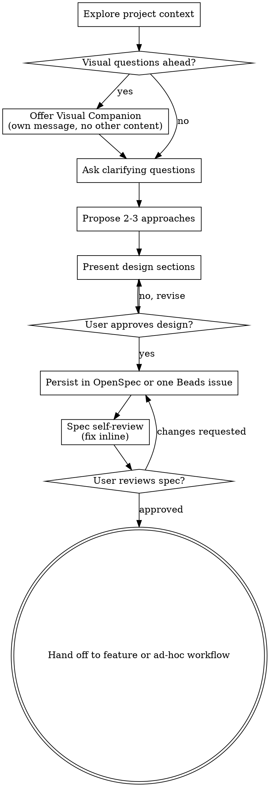

# Brainstorming Ideas Into Designs

Help turn ideas into fully formed designs and specs through natural collaborative dialogue.

Start by understanding the current project context, then ask questions one at a time to refine the idea. Once you understand what you're building, present the design and get user approval.

<HARD-GATE>
Do NOT invoke any implementation skill, write any code, scaffold any project, or take any implementation action until you have presented a design and the user has approved it. This applies to EVERY project regardless of perceived simplicity.
</HARD-GATE>

## Anti-Pattern: "This Is Too Simple To Need A Design"

Every project goes through this process. A todo list, a single-function utility, a config change — all of them. "Simple" projects are where unexamined assumptions cause the most wasted work. The design can be short (a few sentences for truly simple projects), but you MUST present it and get approval.

## NEVER

- **NEVER skip the design/approval gate because the task "looks simple."** A todo list, a
  single-function utility, a config change — these are exactly where unexamined assumptions cause
  the most wasted work, not the least. The design can be a few sentences, but it must still be
  presented and approved (see HARD-GATE above).
- **NEVER treat brainstorming as a rubber stamp on an already-decided approach.** Even when the
  user arrives with a fixed idea, still explore trade-offs and propose 2-3 approaches. Jumping
  straight to "sounds good, let's build it" defeats the entire requirements-refinement step this
  skill exists to force.
- **NEVER invoke frontend-design, or any other implementation skill, before the user has approved
  a written design.** After approval, route durable work through the repository workflow: `feature`
  for proposal-lane work, or exactly one Beads issue for bounded ad-hoc work where Beads is
  available. Do not scaffold or edit implementation directly from brainstorming.
- **NEVER ask more than one question per message.** Batching questions produces shallower answers
  and overwhelms the user; break a multi-part topic into separate one-at-a-time messages instead.
- **NEVER spend a question on something you could discover yourself.** If a fact is findable by
  exploring the filesystem, docs, or existing code, look it up — only genuine decisions (the ones
  only the user can make) should consume a question.
- **NEVER combine the Visual Companion offer with any other content.** It must be its own message
  containing only the offer — folding it into a clarifying question or context summary breaks the
  consent framing (the user may not even notice the offer was made).
- **NEVER present the entire design in one unapproved block.** Get approval section-by-section;
  presenting everything at once reintroduces the same unexamined-assumption risk the HARD-GATE
  exists to prevent.
- **NEVER brainstorm a multi-subsystem request as a single spec.** Flag oversized scope
  immediately and decompose into sub-projects before spending questions refining details that
  belong to a different sub-project's own design cycle.

## Checklist

You MUST create a task for each of these items and complete them in order:

1. **Explore project context** — check files, docs, recent commits
2. **Offer visual companion** (if topic will involve visual questions) — this is its own message, not combined with a clarifying question. See the Visual Companion section below.
3. **Ask clarifying questions** — one at a time, understand purpose/constraints/success criteria
4. **Propose 2-3 approaches** — with trade-offs and your recommendation
5. **Present design** — in sections scaled to their complexity, get user approval after each section
6. **Persist the approved design** — for proposal-lane work, hand it to `feature` so the canonical
   artifacts live under `openspec/changes/<slug>/`; for bounded ad-hoc work, capture the executable
   contract in exactly one Beads issue where Beads is available
7. **Spec self-review** — quick inline check for placeholders, contradictions, ambiguity, scope (see below)
8. **User reviews written spec** — ask user to review the spec file before proceeding
9. **Transition to the canonical workflow** — hand proposal-lane work to `feature`; once its
   artifacts are ready, execution belongs to `apply` or an explicitly selected queue belongs to
   `apply:all`

## Process Flow

**The terminal state is a canonical workflow handoff.** Do NOT invoke frontend-design or another
implementation skill from brainstorming. Proposal-lane work goes to `feature`; bounded ad-hoc work
uses exactly one Beads issue where Beads is available. A ready feature is later executed by
`apply`, or by `apply:all` only when the user explicitly selects an ordered queue.

## The Process

**Understanding the idea:**

- Check out the current project state first (files, docs, recent commits)
- Before asking detailed questions, assess scope: if the request describes multiple independent subsystems (e.g., "build a platform with chat, file storage, billing, and analytics"), flag this immediately. Don't spend questions refining details of a project that needs to be decomposed first.
- If the project is too large for a single change, help the user decompose it into sub-projects:
  what are the independent pieces, how do they relate, and what order should they be built? Then
  brainstorm the first sub-project through the normal design flow. Each feature-sized sub-project
  gets its own OpenSpec change and `apply` lifecycle.
- For appropriately-scoped projects, ask questions one at a time to refine the idea
- Prefer multiple choice questions when possible, but open-ended is fine too
- Only one question per message - if a topic needs more exploration, break it into multiple questions
- Focus on understanding: purpose, constraints, success criteria
- If a fact can be found by exploring the environment (filesystem, existing code, tools) rather
  than asked, look it up. The *decisions* are the user's to make — put each one to them and wait
  for their answer; don't spend a question on something you could have discovered yourself
- For every question, lead with your recommended answer and a short reason — the user should be
  able to accept it in a word rather than having to do the analysis themselves

**Exploring approaches:**

- Propose 2-3 different approaches with trade-offs
- Present options conversationally with your recommendation and reasoning
- Lead with your recommended option and explain why

**Presenting the design:**

- Once you believe you understand what you're building, present the design
- Scale each section to its complexity: a few sentences if straightforward, up to 200-300 words if nuanced
- Ask after each section whether it looks right so far
- Cover: architecture, components, data flow, error handling, testing
- Be ready to go back and clarify if something doesn't make sense

**Design for isolation and clarity:**

- Break the system into smaller units that each have one clear purpose, communicate through well-defined interfaces, and can be understood and tested independently
- For each unit, you should be able to answer: what does it do, how do you use it, and what does it depend on?
- Can someone understand what a unit does without reading its internals? Can you change the internals without breaking consumers? If not, the boundaries need work.
- Smaller, well-bounded units are also easier for you to work with - you reason better about code you can hold in context at once, and your edits are more reliable when files are focused. When a file grows large, that's often a signal that it's doing too much.

**Working in existing codebases:**

- Explore the current structure before proposing changes. Follow existing patterns.
- Where existing code has problems that affect the work (e.g., a file that's grown too large, unclear boundaries, tangled responsibilities), include targeted improvements as part of the design - the way a good developer improves code they're working in.
- Don't propose unrelated refactoring. Stay focused on what serves the current goal.

## After the Design

**Documentation:**

- For proposal-lane work, hand the validated design to `feature`. The repository's OpenSpec schema
  owns the required proposal, delta spec, design, and task artifacts under
  `openspec/changes/<slug>/`.
- For bounded ad-hoc work, capture the goal, constraints, acceptance criteria, and verification in
  exactly one Beads issue where Beads is available. Do not create a separate markdown plan or
  checklist.
- If the active repository has neither OpenSpec nor Beads, use its declared semantic workflow
  binding and keep the approved design in the handoff; do not invent a compatibility directory or
  second execution ledger.
- Use elements-of-style:writing-clearly-and-concisely skill if available
- Let the repository workflow own persistence and commit boundaries

**Spec Self-Review:**
After writing the spec document, look at it with fresh eyes:

1. **Placeholder scan:** Any "TBD", "TODO", incomplete sections, or vague requirements? Fix them.
2. **Internal consistency:** Do any sections contradict each other? Does the architecture match the feature descriptions?
3. **Scope check:** Is this focused enough for a single implementation plan, or does it need decomposition?
4. **Ambiguity check:** Could any requirement be interpreted two different ways? If so, pick one and make it explicit.

Fix any issues inline. No need to re-review — just fix and move on.

**User Review Gate:**
After the spec review loop passes, ask the user to review the written spec before proceeding:

> "The approved design is captured in `<canonical artifact or Beads issue>`. Please review it and
> let me know if you want any changes before we hand it to the repository's execution workflow."

Wait for the user's response. If they request changes, make them and re-run the spec review loop. Only proceed once the user approves.

**Implementation:**

- Hand feature-sized work to `feature`; it may use `writing-plans` to author the canonical
  OpenSpec `tasks.md`, never a standalone plan document.
- Hand a ready named feature to `apply`. Use `apply:all` only for an explicitly selected ordered
  queue.
- For bounded ad-hoc work, claim and execute the one Beads issue through the repository's normal
  ad-hoc lane.

## Key Principles

- **One question at a time** - Don't overwhelm with multiple questions
- **Multiple choice preferred** - Easier to answer than open-ended when possible
- **Look it up, don't ask it** - Discoverable facts come from exploring the repo, not from a
  question; only genuine decisions go to the user
- **Recommend, don't just list** - Every question leads with your pick and why
- **YAGNI ruthlessly** - Remove unnecessary features from all designs
- **Explore alternatives** - Always propose 2-3 approaches before settling (for a contested interface shape at the Design Gate, see [`references/design-it-twice.md`](references/design-it-twice.md) for the parallel divergent-constraint protocol)
- **Incremental validation** - Present design, get approval before moving on
- **Be flexible** - Go back and clarify when something doesn't make sense

## Visual Companion

A browser-based companion for showing mockups, diagrams, and visual options during brainstorming. Available as a tool — not a mode. Accepting the companion means it's available for questions that benefit from visual treatment; it does NOT mean every question goes through the browser.

**Offering the companion:** When you anticipate that upcoming questions will involve visual content (mockups, layouts, diagrams), offer it once for consent:
> "Some of what we're working on might be easier to explain if I can show it to you in a web browser. I can put together mockups, diagrams, comparisons, and other visuals as we go. This feature is still new and can be token-intensive. Want to try it? (Requires opening a local URL)"

**This offer MUST be its own message.** Do not combine it with clarifying questions, context summaries, or any other content. The message should contain ONLY the offer above and nothing else. Wait for the user's response before continuing. If they decline, proceed with text-only brainstorming.

**Per-question decision:** Even after the user accepts, decide FOR EACH QUESTION whether to use the browser or the terminal. The test: **would the user understand this better by seeing it than reading it?**

- **Use the browser** for content that IS visual — mockups, wireframes, layout comparisons, architecture diagrams, side-by-side visual designs
- **Use the terminal** for content that is text — requirements questions, conceptual choices, tradeoff lists, A/B/C/D text options, scope decisions

A question about a UI topic is not automatically a visual question. "What does personality mean in this context?" is a conceptual question — use the terminal. "Which wizard layout works better?" is a visual question — use the browser.

If they agree to the companion, read the detailed guide before proceeding:
`skills/brainstorming/visual-companion.md`
